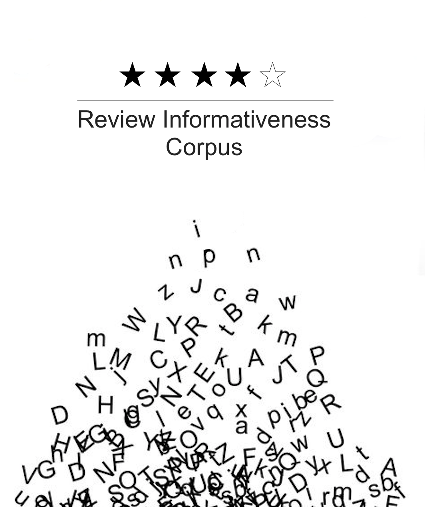

**This Corpus has been gathered and analyzed by Niki Hajmoshir [email](niki.hajmoshir@gmail.com), Shonna Gu [email](shuanggu.gs@gmail.com) and Roy Guo [email](guohaidsg@gmail.com).**

------------------------------

### **This Repository is a website interface for review informativeness corpus.**

### [interface:](https://github.ubc.ca/nikihm/Review-Informativeness-Corpus/tree/master/interface) 

- [frontend.html:](https://github.ubc.ca/nikihm/Review-Informativeness-Corpus/blob/master/interface/frontend.html) front end html document.
- [backend.py:](https://github.ubc.ca/nikihm/Review-Informativeness-Corpus/blob/master/interface/backend.py)  python document that implements functionality of the interface.
- [frontend.js:](https://github.ubc.ca/nikihm/Review-Informativeness-Corpus/blob/master/interface/frontend.js) javascript document that carries out the communication between frontend.html document and the Python back-end (backend.py).
- [frontend.css:](https://github.ubc.ca/nikihm/Review-Informativeness-Corpus/blob/master/interface/frontend.css) A css document that customizes web page.

#### [data:](https://github.ubc.ca/nikihm/Review-Informativeness-Corpus/tree/master/interface/data)

- [corpus.json:](https://github.ubc.ca/nikihm/Review-Informativeness-Corpus/blob/master/interface/data/corpus.json) whole corpus
- [subset_corpus_annotated.json:](https://github.ubc.ca/nikihm/Review-Informativeness-Corpus/blob/master/interface/data/subset_corpus_annotated.json) Annotated corpus

#### [user-guide.md:](https://github.ubc.ca/nikihm/Review-Informativeness-Corpus/blob/master/user-guide.md)
This markdown file provides a detailed instructions on how to operate this web interface.

