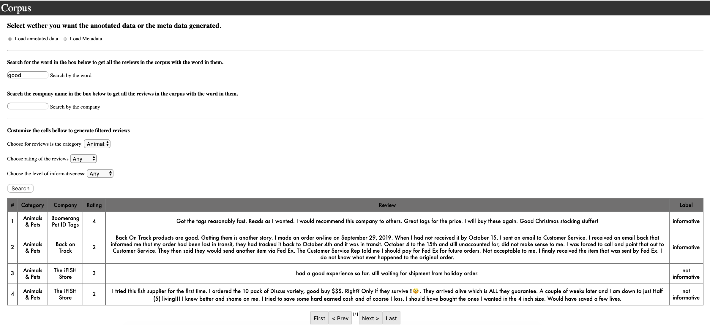
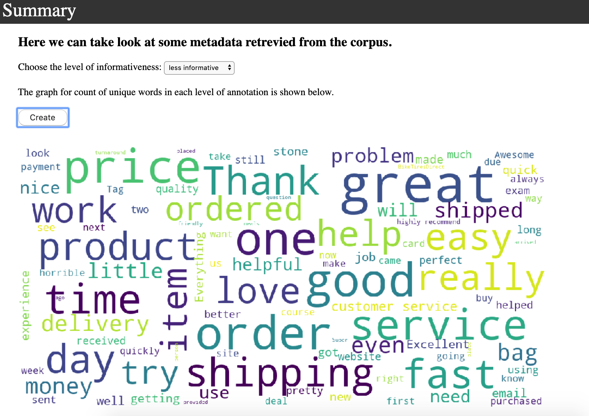

### Requirements For Corpus to Run:
Make sure the following libraries and python version is installed in your personal computer.

- Python version 3.7
- "pip install urllib3" : [Further Documentation](https://pypi.org/project/urllib3/)
- "pip install --user -U nltk" : [Further Documentation](https://www.nltk.org/install.html)
- "python -m pip install -U pip", "python -m pip install -U matplotlib" : [Further Documentation](https://matplotlib.org/users/installing.html)
- "pip install wordcloud" : [Further Documentation](https://pypi.org/project/wordcloud/)

### User Instruction Guidelines:

1) Clone this repository into your presonal computer.

2) Using terminal navigate the the "Interface" directory.

3) Once inside the directory print the following command in the terminal:
    - python backend.py
   
4) Open up a web browser and search the following url:
    - Localhost:9998
    
5) This show load uo the Review Informativeness Corpus

-------

### Interface Guidelines:

The website is navigable thorugh the side bar on the left side of the screen.

- **About** tab consist of information and statistics of the corpus.

- **corpus** tab provides user with a search engine that allows to generate reviews from the corpus with desired filters. Below is an example of a search. 

- **Anotation** tab showcases the rules for cuurent annotations and furthur improvements that could be made for future annotations

- **Summary** tab allows user to look at the meta data gathered by the corpus, such as the word cloud of the category. 

